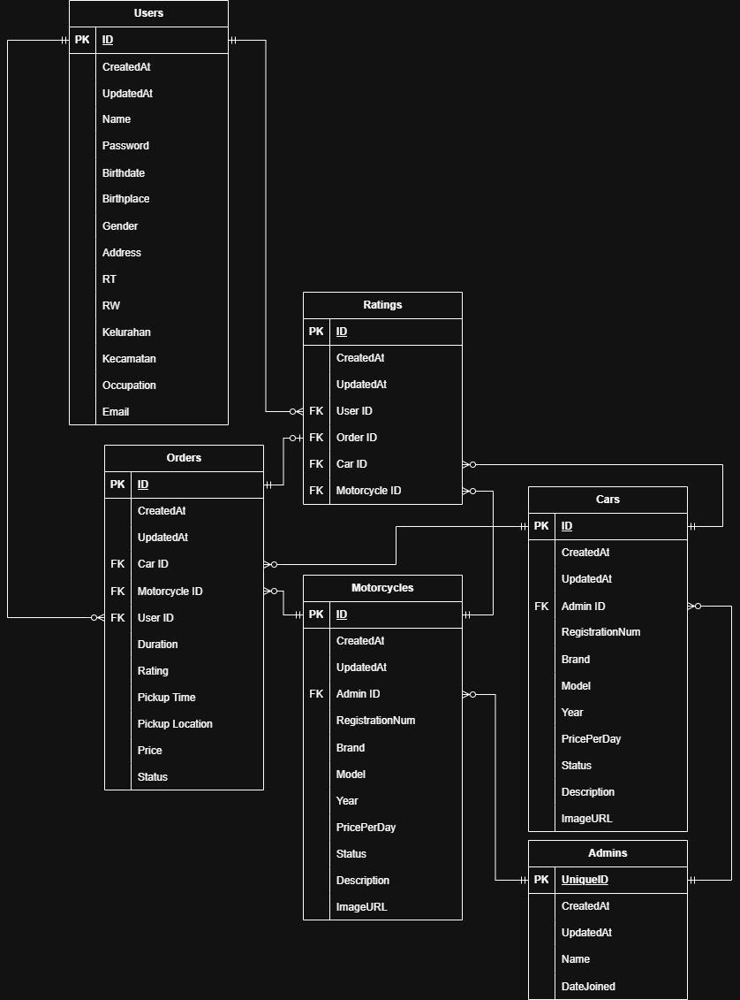

# Setor-Mobil Backend

## ERD

**WHENEVER THERE'S _BOTH_ MOTORCYCLE_ID AND CAR_ID IN THE SAME TABLE, THEIR RELATION ARE EXCLUSIVE TO EACH OTHER**

**MEANING THAT BOTH FIELDS _CAN NOT_ BE POPULATED SIMULTANEOUSLY**

**BUT THERE MUST BE _EXACTLY ONE_ NON-NULL FIELD**

## TODO

- Better logging (middleware logging, instead of per-function logging, perhaps?)
- GraphQL for fetching data to fetch only the data needed (e.g. overfetching on Car DTO)
- Make better DB scheme (e.g. allow multiple car/bike per order, merge cars/bikes table as vehicles if separation isn't needed)
- Refactor login function, it's close enough that I think it can be turned into a generic function, usable for both admin and user login
- Protect certain routes with a new middleware, making it admin-only. Currently user JWT token can let them access admin endpoint. For now, this is fine, mitigated by the frontend being two different applications. But in the future, this is a bad security hole. Important to fix.
- Use OpenAPI/Swagger to generate code from specification, for REST API

## Flow for new feature addition

1. Define tables in `models/`
2. Refactor other tables to resolve relationship, if needed
3. Implement `Model` interface, and other interfaces if applicable.
4. Edit the migration to add the newly made table
5. Define the DTO needed for said feature
6. Implement the services needed
7. Set the route and the function called on said route
8. Add seed data, and call it
